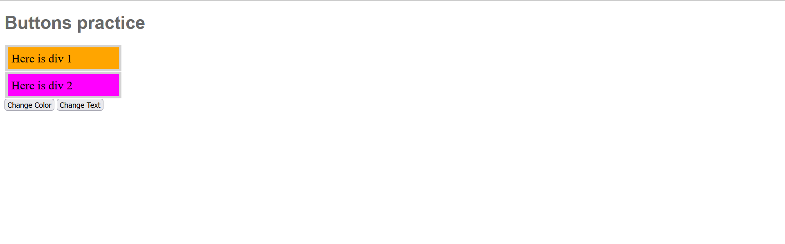
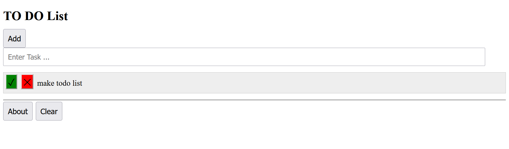
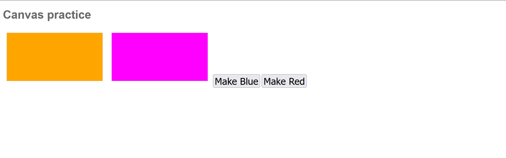
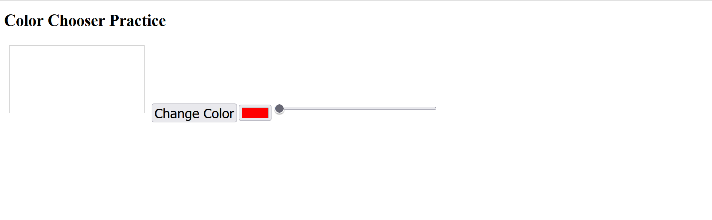
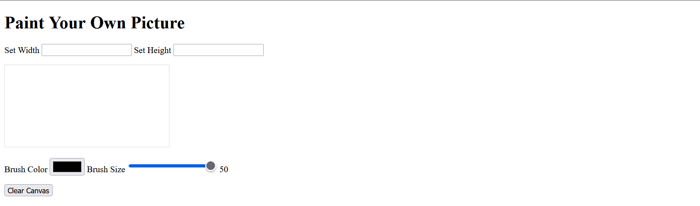
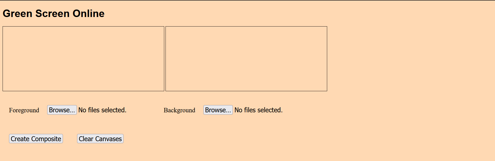

# WEEK 3 NOTES

## Project 1 - Change Pages Interactively -
 
### Project Result
</img>

### Project README file
<a href="https://github.com/KanzyKhaled/Java-Programming-and-Software-Engineering-Fundamentals-Specialization-by-Duke-University/blob/main/Programming-Foundations-with-JavaScript-HTML-and-CSS/Week3/Exercises/project-1/README.md"> README file </a>

## Project 2 - TODO LIST -
 
### Project Result
</img>

### Project README file
<a href="https://github.com/KanzyKhaled/Java-Programming-and-Software-Engineering-Fundamentals-Specialization-by-Duke-University/blob/main/Programming-Foundations-with-JavaScript-HTML-and-CSS/Week3/Exercises/project-2/README.md"> README file </a>

## Project 3 - Canvas -
 
### Project Result
</img>

### Project README file
<a href="https://github.com/KanzyKhaled/Java-Programming-and-Software-Engineering-Fundamentals-Specialization-by-Duke-University/blob/main/Programming-Foundations-with-JavaScript-HTML-and-CSS/Week3/Exercises/project-3/README.md"> README file </a>

## Project 4 - Color Chooser -
 
### Project Result
</img>

### Project README file
<a href="https://github.com/KanzyKhaled/Java-Programming-and-Software-Engineering-Fundamentals-Specialization-by-Duke-University/blob/main/Programming-Foundations-with-JavaScript-HTML-and-CSS/Week3/Exercises/project-4/README.md"> README file </a>

## Project 5 - An Interactive Paint Canvas -
 
### Project Result
</img>

### Project README file
<a href="https://github.com/KanzyKhaled/Java-Programming-and-Software-Engineering-Fundamentals-Specialization-by-Duke-University/blob/main/Programming-Foundations-with-JavaScript-HTML-and-CSS/Week3/Exercises/project-5/README.md"> README file </a>

## Project 6 - Green Screen Online -
 
### Project Result
</img>

### Project README file
<a href="https://github.com/KanzyKhaled/Java-Programming-and-Software-Engineering-Fundamentals-Specialization-by-Duke-University/blob/main/Programming-Foundations-with-JavaScript-HTML-and-CSS/Week3/Exercises/project-6/README.md"> README file </a>